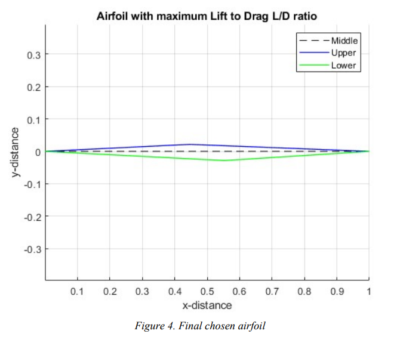

# Supersonic-Airfoil-Design-Aerodynamic-Analysis
The goal is to maximize the lift-to-drag ratio for straight edge supersonic airfoils using numerical methods. The analysis uses Oblique Shock-Expansion Wave theory to estimate pressure distribution, thereby calculating the lift, drag, and pitching moments.

An 'Exhaustive Search' method is performed using MATLAB to produce a wide range of airfoils to choose from. A list of feasible designs are produced that meet three specific design constraints and final airfoil with maximum L/D is mapped. 

## Design Optimization Constraints
- airfoil thickness 5% of chord length
- lift coefficient > 0.2
- pitching moment coefficient < 0.08

### Main Run File:
- **KA.m**

### Supporting function calls:
- oswbeta.p
- pm.p
- thetamax.p

## Expected Results
A final airfoil design is mapped chosen from the given constraints. The constraints can be modified accordingly. 

